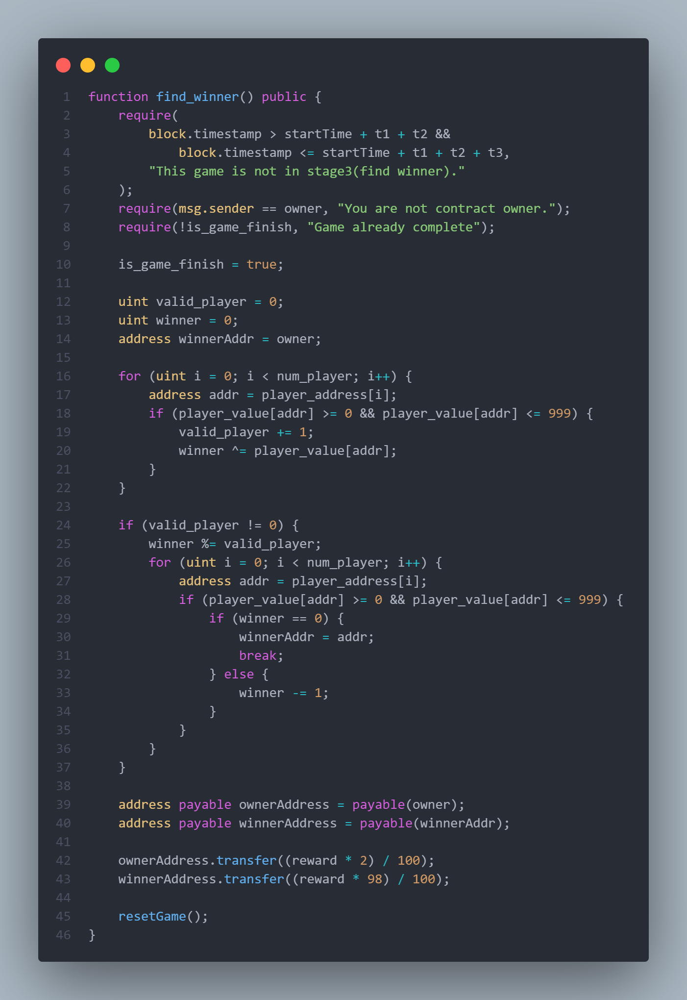
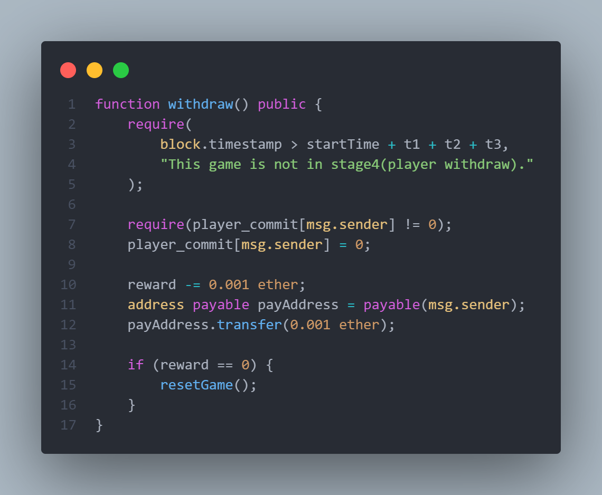

# Lottery Contract (Solidity)
---

### Public Variable:
- `owner` : address of the owner of the contract.
- `t1` : time when change the state of the contract to `reveal_data`.
- `t2` : time when change the state of the contract to `find_winner`.
- `t3` : time when change the state of the contract to `player_withdraw`.
   
- `num_player` : number of player in the game.
- `max_player` : maximum number of player in the game.
- `startTime` : time when the game start (player 1 join the game).
- `reward` : total reward in the game.
   
- `player_commit` : mapping of player address to their commit value.
- `player_address` : mapping of player index to their address.
- `player_value` : mapping of player address to their real value.
   
- `is_game_finish` : boolean to check if the game is finish.
---

### Constructor:
1. Set the value of `t1`, `t2`, `t3`, and `max_player`.
2. Set the `owner` of the contract.
---

### View Function:
- `view_game_state` : return the current state of the game.
- `hashInp` : return the hash of the input value and salt.
---

### Stage 1 (add_player):
1. Check if the game is in stage 1 (add_player).
2. Check if the player send 0.001 ether.
3. Check if the player already join the game or not.
4. Check if the room is full or not.
5. Set the `startTime` if the game is not start yet.
6. Set the player commit value.
7. Add the player address to the mapping.
8. Add the player value `1000` to the mapping (`1000` mean `invalid`).
9. Increase the number of player.
---

### Stage 2 (reveal_data):
1. Check if the game is in stage 2 (reveal_data).
2. Check if the player reveal the correct value.
3. Set the player value (in stead of `1000`).
---

### Stage 3 (find_winner):
1. Check if the game is in stage 3 (find_winner).
2. Check if the sender is the owner of the contract.
3. Check if the game is not finish yet.
4. Set the game finish (to prevent double withdraw).
5. Find the winner by XOR all the valid player value.
6. Transfer the reward to the owner and the winner (if there is no winner, default winner is the owner).
7. Call the `resetGame` function.
---

### Stage 4 (player_withdraw):
1. Check if the game is in stage 4 (player_withdraw).
2. Check if the player already join the game.
3. Set the player commit value to `0`. (to prevent double withdraw).
4. Assert the reward is not empty. (to prevent error).
5. Transfer the reward to the player.
6. Call the `resetGame` function if the reward is empty.
---

### Reset Game:
1. Reset all the player data.
2. Set the game finish to `false`.
3. Set the number of player to `0`.
4. Set the reward to `0`.
5. Set the `startTime` to `0`.
---